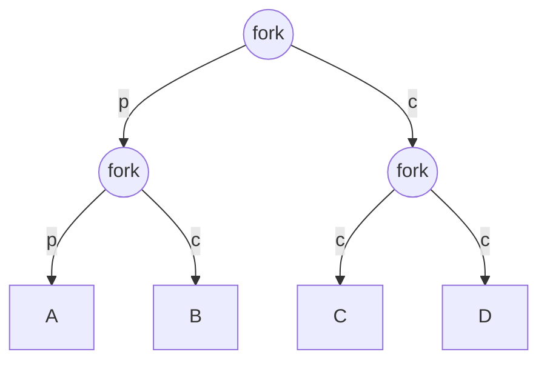
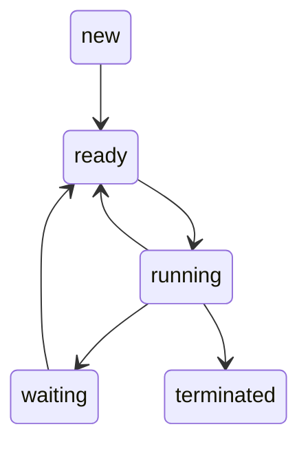

10.07.2024 - Omar Richi (omar.richi@rwth-aachen.de)

```ad-note
title: General Informations
The notes will be similar to the tutorial, with basics followed by the exercises.

I will try to make two versions for each tutorial sheet, in German and in English.

I have also decided to create a Discord server. Joining is, of course, voluntary; it is just an offer, as you can reach me there a bit faster than by email.
https://discord.gg/97jDeFcXxZ
```

### Question 1: 

Consider the following piece of C code:

```c
int main() {
	fork();
	fork();
	exit();
}
```

How many processes are created during the execution of this program?

*Grundlagen:* 
- The 5 important syscalls are: 
- read, write, open, close, fork
- General information about fork:
	- Fork creates a copy process from a parent process; both processes are initially identical. The copy is called the child process, and the original process is called the parent process.
	- Each process has a unique PID, which allows us to distinguish between the parent and child processes.
	- When executing fork, you get a result back (a PID).
		- If this result is −1-1−1, then fork has failed.
		- if it is $> 0$, then the result is the PID of the parent process, which has returned the result. 
		- if it is $= 0$, then the child process is being addressed and has returned $0$
	- Through this distinction, you can issue instructions only for the child or only for the parent by checking the fork results.

*Lösung:*


This is just an example fork tree for illustration. The parent process always continues to the left, and the child processes are created to the right.

- First fork: 1 parent creates 1 child
- Second fork: each of the two processes create an additional process
- We end up with 3 new processes created

### Question 2:

In a non-preemptive batch system, there are four jobs waiting to be executed with expected run times: A(9), B(6), C(3), D(5). Which scheduling algorithm should be used to minimize the average response time (latency)? What would be the optimal order for running these jobs?

*Grundlagen:*


What is Scheduling?
- Distribution and allocation of limited resources to processes.
    - For example, if two processes exist, the scheduler decides which process should be executed next.
- There are several scheduling strategies that aim to achieve the following goals:
    1. Fairness: Every process should be treated fairly, meaning each process should receive its CPU allocation after a certain amount of time.
    2. CPU Utilization: The CPU should not have idle time; it should be kept as busy as possible.
    3. Maximizing Throughput: The number of processes completed per unit of time should be as high as possible.
    4. Minimizing Turnaround Time: This starts when the process arrives and ends when the process terminates. We cannot change how long a process takes to complete, but we can ensure it doesn't have to wait long, for example.
    5. Minimizing Response Time: Ensure quick system responses to inputs, meaning the time between the process arriving and its first execution should be minimized.

In scheduling, a distinction is made between **preemptive** and **non-preemptive**.

|                                    Präemptiv                                    |                        Non-Präemptiv                        |
|:-------------------------------------------------------------------------------:|:-----------------------------------------------------------:|
|                       Allows processes to be interrupted                        | Processes run until they terminate (or the PC is shut down) |
|              Allows other processes to be interleaved or inserted               |                                                             |
|                      Interrupted processes can be resumed                       |                                                             |
|           Examples: Round Robin, SRPT (Shortest Remaining Time First)           |                     Examples: FIFO, SPT                     |
| Drawback: High number of context switches (Increases the time until completion) |        Drawback: Processes can block for a long time        | 

_Solution:_
- Only the expected runtime is given in the question, so we opt for SPT (since this method focuses solely on execution time).
- The order is then: $C(3),D(5),B(6),A(9)$
- The latency is calculated as follows:
$$\frac{(3+(3+5)+(3+5+6)+(3+5+6+9))}{4}=12$$

### Question 3:

Suppose we are operating a preemptive system using the algorithm identified in the previous question. At time t=10, two new processes arrive, E(2) and F(7). what is the current state of the processes? Which scheduling algorithm should be employed now to minimize the average response time? What will be the sequence of execution  starting from t=10 to achieve this goal?

_Solution:_

- We will use the modified version of SPT, namely SRPT.
- At time $t = 10$, $C(3)$ and $D(5)$ will have completed their execution. $B$ will then be executed for two units of time.
- The remaining processes are now: $B(4),A(9),E(2),F(7)$
- At time 10, we will have a context switch, as $E(2)$ has less execution time left than $B(4)$.
- The new order is therefore: $E(2),B(4),F(7),A(9)$
-The latency from $t=10$ onwards is thus: $$\frac{(2+(2+4)+(2+4+7)+(2+4+7+9))}{4}=10.75$$


### Question 4:

Why in addition to the states $ready$ and $running$, is there another state called $blocked$? What is achieved by this state?

Using the top program in the Linux shell, you can view the processes currently managed by the kernel. It provides a real-time view, including current information about process state, CPU usage, and memory usage. On a typical Linux system, you’ll notice that a large number of processes are in the sleeping state (corresponds to blocked based on our definition). This does not represent the ready state - which is combined with the running state in top. What do you suspect: why are so many processes in the blocked state?

_Basics:_ 
Process State Diagram:



- These processes are typically I/O processes that should only be executed when they are being used or required.
- If they are not being used, for example, a printer, they will not receive CPU time to prevent them from unnecessarily blocking the CPU.

## Tasks

### Task 2.1 Process and Process Creation

write a simple C program following these specifications:

- Create and initialize a global variable to 0
- Inside a loop, each iteration will:
	- increment the global variable
	- Call ```fork()```
	- The child should print "Child" followed by its $pid$ and the value of the global variable 
	- The parent should print “Parent” followed by its $pid$ and the value of the global variable
	- When the global variable reaches 5, exit the loop and exit the program
- Ensure that each parent and child processes continue to execute the loop until the variable reaches 5

*Question*: Observe the output, how many processes are created by the end of execution? What happens if the loop doesn't stop so early?

*Lösung:*

```c
#include <stdio.h>
#include <stdlib.h>
#include <unistd.h>

int global_variable = 0;

int main() {
pid_t pid;

	while (global_variable++ < 5) {
	
	pid = fork();
	if (pid == -1) {
		perror("fork");
		exit(EXIT_FAILURE);
	} else if (pid == 0)
		printf("Child: Global variable = %d, PID = %d\n", global_variable, getpid());
	else  
		printf("Parent: Global variable = %d, PID = %d\n", global_variable, getpid());  
	}  
	return 0;  
}
```

1st loop: 1 process created, total = 2 
2nd loop: 2 processes created, total = 4 
3rd loop: 4 processes created, total = 8 
4th loop: 8 processes created, total = 16 
5th loop: 16 processes created, total = 32

 - In total, there are 32 processes, with 31 of them being newly created.
- If the loop keeps going, we would quickly saturate the number of processes in the operating system, which is usually called a fork bomb, and it can crash the system.

### Task 2.2 Thread global variable increment

Modify the program from Task 2.1 to use threads instead of fork(). Use the pthread API (```pthread_create```, ```pthread_exit```,```pthread_join```).

*Question*: how many threads are created in total? Why is it different from the ```fork``` version

*Solution:*

```c
#include <pthread.h>
#include <stdio.h>
#include <stdlib.h>

int global_variable = 0;
void *thread_routine(void *args) {
  pthread_t current = (pthread_t)args;
  /* maximum number of threads that a thread can create, in this specific case
   */
  pthread_t thread_id[5];
  /* we keep track of the number of threads created within this thread */
  int nb_childs = 0;
  while (global_variable < 5) {
    global_variable++;
    printf("Thread %lu, Global variable %d\n", current, global_variable);
    pthread_create(&thread_id[nb_childs], NULL, thread_routine,
                   &thread_id[nb_childs]);
    nb_childs++;
  }
  for (int id = 0; id < nb_childs; id++) {
    pthread_join(thread_id[id], NULL);
  }
  return NULL;
}
int main() {
  long main_thread_id = 0;
  thread_routine(&main_thread_id);
  return 0;
}

```

- 5 threads are created. (Sometimes more threads can be created because of the lack of synchronization mechanisms).
- The address space of every thread is now shared, so is the global variable. Every thread is incrementing the same variable until 5, so only five threads are created.

### Task 2.3 Exec Syscall

Write a C program that performs a ```fork()```. The child process should execute the ```ls /``` command using ```execl()```, while the parent waits for the child to finish and then prints a completion message.

Here is the example how to use the ```execl``` syscall:

```c
int execl(const char *pathname, const char *arg, ...
/*, (char *) NULL */);
```

```c
// note that:
// - the argument after the executable should contain the 
// - the last argument should be NULL
int ret = execl("/bin/ls","ls", "/", NULL);
```

*Solution:*

```c
#include <stdio.h>
#include <stdlib.h>
#include <sys/wait.h>
#include <unistd.h>

int main() {
  pid_t pid = fork();

  if (pid == 0) {
    if (!execl("/bin/ls", "ls", "/", NULL)) {
      perror("execve\n");
    }
  } else if (pid == -1) {
  	perror("fork");
  }
  wait(&pid);

  printf("\nChild exited!\n");
}

```

Write a second C program that has the same behavior, except that it will create a new thread instead of a fork. The new thread will be calling the ```ls /``` command with ```execl()```. The main thread should be waiting for the child completion and print an exit message.

*Solution:*

```c
#include <stdio.h>
#include <pthread.h>
#include <stdlib.h>
#include <unistd.h>

void *routine(void *arg) {
  if (!execve("/bin/ls", arg, NULL)) {
	  perror("execve");
  }
  return NULL;
}

int main() {
  pthread_t tid;

  char *args[] = {"ls", "/", NULL};
  pthread_create(&tid, NULL, routine, args);
  pthread_join(tid, NULL);

  printf("\nchild exited\n");
}

```


*Questions*: What differences do you observe between using ```fork()``` and creating a new thread (```pthread_create()```) in this context?

We notice that the main thread never prints its message (in the threaded version). The child calls ```exec``` causing its address space to be replaced with the address space of the ```ls``` executable. Since the parent and the child share the same address space, the whole address space of the two threads is replaced as well by the code of ```ls``` . Since it wouldn’t make sense to keep the main from executing arbitrary code, the implementation of the syscall includes the follow comment:

```ad-abstract
title: All threads other than the calling thread are destroyed during an execve(). Mutexes, condition variables, and other pthreads objects are not preserved.
```

- Beachtet, dass ```execl()```, die Version, die wir verwendet haben, immer ```
execve()``` aufruft


### Task 2.4 Scheduling Algorithms Implementation

For this week’s assignment, you will be implementing various scheduling algorithms seen during the lecture. It will include some interactive and batch scheduler. 
Begin by defining C structs that can manipulate abstract programs. Consider the necessary fields these structs will require, as well as additional structures needed by an operating system to facilitate scheduling (events, states, etc.). 
Some schedulers are preemptive, what additional event would be needed?

*Questions:*
1. Define a ```struct``` for representing a program ( ```task``` ). What fields should this ```struct``` include to manage program execution and scheduling? Provide a detailed list of essential fields and their purposes.
2. Describe subsequent data structures that an operating system would use to handle scheduling. How would this structure maintain and manage the list of ready processes efficiently? Discuss possible implementations.


```c
	// Scheduling-related enum
	enum state {
	BLOCKED,
	RUNNING,
	READY
	};

	enum event {
	START,
	WAIT,
	WAKE_UP,
	TERMINATE,
	CLOCK_TICK
	};

	// Struct representing a program/task
	struct task{
	int pid; // Process ID
	int ppid; // Parent Process ID
	int registers[20]; // Register set
	
	unsigned int cputime: // CPU time consumed
	unsigned int alarm; // Alarm for time-based events
	
	enum state state; // Current state of the task
	
	// Other necessary fields...
	};

	// Run queue to manage ready processes
	// This could be implemented using a linked list of fixed-size array
```