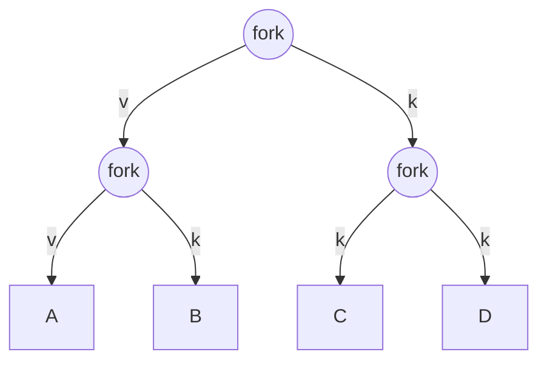
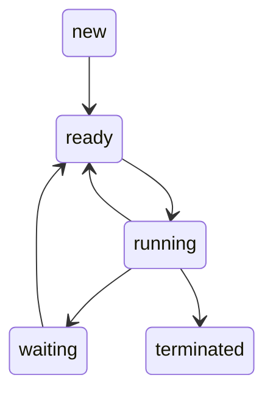

10.07.2024 - Omar Richi (omar.richi@rwth-aachen.de)

```ad-note
title: Allgemeines
Die Notizen werden ähnlich zum Tutorium sein, mit Grundlagen gefolgt von den Aufgaben.

Ich werde versuchen, für jedes Tutorium-Blatt zwei Versionen zu machen, auf Deutsch und auf Englisch. 

Ich habe mich auch entscheiden einen Discord Server zu erstellen. Das Beitreten ist natürlich freiwillig, es ist nur ein Angebot, denn dort erreicht ihr mich etwas schneller als per Mail.
https://discord.gg/97jDeFcXxZ
```

### Question 1: 

Consider the following piece of C code:

```c
int main() {
	fork();
	fork();
	exit();
}
```

How many processes are created during the execution of this program?

*Grundlagen:* 
- die 5 wichtigen Syscalls sind: 
- read, write, open, close, fork
- Allgemein zur fork:
	- Fork erzeugt einen Kopieprozess aus einem Vaterprozess, beide Prozesse sind zunächst identisch. Die Kopie wird Kindprozess genannt und der originale Prozess wird Vaterprozess genannt.
	- Jeder Prozess hat einen eindeutigen PID, damit können wir aber auch zwischen Vater- und Kindprozess unterscheiden
	- Beim Ausführen von Fork, bekommt man einen Resultat zurück (einen PID zurück).
		- Falls dieser Resultat $-1$ ist, dann ist fork fehlgeschlagen
		- Falls diese $> 0$ ist, dann ist der Resultat, die PID von dem Vater prozess, und er hat den Resultat zurückgegeben 
		- Falls diese $= 0$ ist, dann ist das Kindprozess angesprochen worden und hat 0 zurück gegeben
	- Durch diese Unterscheidung, kann man mit Anfragen nach fork Resultaten, Anweisungen nur für das Kind bzw. nur für den Vater geben

*Lösung:*

Das hier ist nur ein Beispiel Forkbaum zur Veranschaulichung, links geht immer das Vaterprozess weiter, und rechts werden dann die Kindprozesse erzeugt,

- erstes fork: ein Vater erzeugt ein Kind prozess
- zweites fork: Jede von den zwei Prozesse erzeugt weiter ein Kindprozess
- Insgesamt haben wir 4 Prozesse, davon sind 3 durch die forks neu erzeugt worden

### Question 2:

In a non-preemptive batch system, there are four jobs waiting to be executed with expected run times: A(9), B(6), C(3), D(5). Which scheduling algorithm should be used to minimize the average response time (latency)? What would be the optimal order for running these jobs?

*Grundlagen:*


Was ist Scheduling?
- Verteilung und Zuweisung von begrenzten Ressourcen an Prozessen
    - Wenn z.B. zwei Prozesse existieren, dann entscheidet der Scheduler welcher Prozess als nächstes ausgeführt werden soll.
- Es gibt mehrere Schedulingstrategien, die versuchen folgende Ziele zu erreichen:
    1. Fairness: Jeder Prozess soll fair behandelt werden, D.h jeder Prozess soll nach einer gewissen Zeit seine CPU-Zuteilung bekommen
    2. Auslastung der CPU: Die CPU darf keine Pause haben, sie soll möglichst ausgelastet werden
    3. Durchsatz maximieren: Die Anzahl der zubearbeiteten Prozesse soll pro Zeiteinheit möglichst hoch sein.
    4. Minimierung der Ausführungszeit: Diese beginnt wenn der Prozess an kommt, und endet wenn der Prozess terminiert, Wir können nicht ändern wie lange ein Prozess braucht, jedoch können wir dafür sorgen, dass er nicht viel warten muss zum Beispiel.
    5. Antwortzeit minimieren: sorgen für schnelle Reaktionen des Systems auf die Eingaben, also die Zeitspanne zwischen ankommen des Prozesses und die erste Ausführung sollte minimiert sein.

beim Scheduling unterscheidet man zwischen **Präemptiv** und **Non-Präemptiv**

|                                  Präemptiv                                  |                             Non-Präemptiv                             |
|:---------------------------------------------------------------------------:|:---------------------------------------------------------------------:|
|                     Ermöglicht Prozesse zu unterbrechen                     | Prozesse laufen bis sie terminieren  (Oder der PC wird ausgeschaltet) |
|               Andere Prozess können zwischengeschoben werden                |                                                                       | 
|              Unterbrochenen Prozesse können fortgesetzt werden              |                                                                       |
|           Bsp: Round Robin, SRPT (Shortest Remaining Time First)            |                            Bsp: FIFO, SPT                             |
| Nachteil: höhe Anzahl an Kontextwechsel (Verlängert die Zeit bis Bedingung) |       Nachteil: Prozesse können für eine lange Zeit blockieren        |

*Lösung:* 
- In der Frage ist lediglich die erwartete Laufzeit gegeben, deswegen entscheiden wir uns für SPT (da diese Methode sich nur auf die Ausführungszeit fokussiert).
- Die Reihenfolge ist dann: $C(3),D(5)B(6),A(9)$
- die Latenz wird hierfür folgendes gerechnet:
$$\frac{(3+(3+5)+(3+5+6)+(3+5+6+9))}{4}=12$$

### Question 3:

Suppose we are operating a preemptive system using the algorithm identified in the previous question. At time t=10, two new processes arrive, E(2) and F(7). what is the current state of the processes? Which scheduling algorithm should be employed now to minimize the average response time? What will be the sequence of execution  starting from t=10 to achieve this goal?

*Lösung:* 
- Wir nehmen die geänderte Version von SPT nämlich SRPT
- Bei Zeit $t = 10$ werden $C(3)+D(5)$ ihre Ausführung durch haben. $B$ wird dann für zwei Zeiteinheiten ausgeführt.
- Folgende Prozesse sind nun geblieben: $B(4),A(9),E(2),F(7)$
- Bei Zeit 10 werden wir einen Kontextwechsel haben, da $E(2)$, weniger Ausführungszeit hat als $B(4)$
- Die neue Reihenfolge ist somit: $E(2),B(4),F(7),A(9)$
- Die Latenz ab $t=10$ ist somit: $$\frac{(2+(2+4)+(2+4+7)+(2+4+7+9))}{4}=10.75$$


### Question 4:

Why in addition to the states $ready$ and $running$, is there another state called $blocked$? What is achieved by this state?

Using the top program in the Linux shell, you can view the processes currently managed by the kernel. It provides a real-time view, including current information about process state, CPU usage, and memory usage. On a typical Linux system, you’ll notice that a large number of processes are in the sleeping state (corresponds to blocked based on our definition). This does not represent the ready state - which is combined with the running state in top. What do you suspect: why are so many processes in the blocked state?

*Grundlagen:* 
Prozess-Zustands-Diagramm:



- Diese Prozesse, sind in der Regel I/O prozesse, die nur ausgeführt werden sollen wenn sie benutzt bzw. genötigt werden.
- Wenn sie nicht benutzt werden zum Beispiel ein Drucker, werden sie keine CPU-Zeit bekommen, damit sie nicht die CPU umsonst blockieren.

## Tasks

### Task 2.1 Process and Process Creation

write a simple C program following these specifications:

- Create and initialize a global variable to 0
- Inside a loop, each iteration will:
	- increment the global variable
	- Call ```fork()```
	- The child should print "Child" followed by its $pid$ and the value of the global variable 
	- The parent should print “Parent” followed by its $pid$ and the value of the global variable
	- When the global variable reaches 5, exit the loop and exit the program
- Ensure that each parent and child processes continue to execute the loop until the variable reaches 5

*Question*: Observe the output, how many processes are created by the end of execution? What happens if the loop doesn't stop so early?

### Task 2.2 Thread global variable increment

Modify the program from Task 2.1 to use threads instead of fork(). Use the pthread API (```pthread_create```, ```pthread_exit```,```pthread_join```).

*Question*: how many threads are created in total? Why is it different from the ```fork``` version


*Lösung:*
```c
#include <stdio.h>
#include <stdlib.h>
#include <unistd.h>

int global_variable = 0;

int main() {
pid_t pid;

	while (global_variable++ < 5) {
	
	pid = fork();
	if (pid == -1) {
		perror("fork");
		exit(EXIT_FAILURE);
	} else if (pid == 0)
		printf("Child: Global variable = %d, PID = %d\n", global_variable, getpid());
	else  
		printf("Parent: Global variable = %d, PID = %d\n", global_variable, getpid());  
	}  
	return 0;  
}
```

1. Loop: 1 Prozess wird erzeugt: Gesamt = 2
2. Loop: 2 Prozess wird erzeugt: Gesamt = 4
3. Loop: 4 Prozess wird erzeugt: Gesamt = 8
4. Loop: 8 Prozess wird erzeugt: Gesamt = 16
5. Loop: 16 Prozess wird erzeugt: Gesamt = 32

- Insgesamt gibt's 32 Prozesse, 31 davon sind neu erzeugt
- Falls die Schleife weitergeht, dann erreicht man die maximale Anzahl an Prozesse in dem System, d

### Task 2.3 Exec Syscall

Write a C program that performs a ```fork()```. The child process should execute the ```ls /``` command using ```execl()```, while the parent waits for the child to finish and then prints a completion message.

Here is the example how to use the ```execl``` syscall:

```c
int execl(const char *pathname, const char *arg, ...
/*, (char *) NULL */);
```

```c
// note that:
// - the argument after the executable should contain the 
// - the last argument should be NULL
int ret = execl("/bin/ls","ls", "/", NULL);
```

Write a second C program that has the same behavior, except that it will create a new thread instead of a fork. The new thread will be calling the ```ls /``` command with ```execl()```. The main thread should be waiting for the child completion and print an exit message.

*Questions*: What differences do you observe between using ```fork()``` and creating a new thread (```pthread_create()```) in this context?

